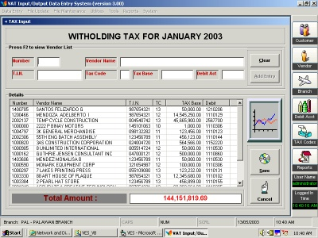



## VAT Input / Output Data Entry System

### Description

A simple system used to calculate VAT input, witholding tax of a certain vendor and VAT output/VAT output (exempt) of a certain customer. Transactions are converted into a text file and can be remitted to BIR (Bureau of Internal Revenue) office.

It can be used by any company especially in the philippines...
 
### More Info
 

             |
---                |---
**Submitted On**   |2003-05-27 18:16:20
**By**             |[Adel D\. Mendoza](https://github.com/Planet-Source-Code/PSCIndex/blob/master/ByAuthor/adel-d-mendoza.md)
**Level**          |Beginner
**User Rating**    |4.8 (19 globes from 4 users)
**Compatibility**  |VB 6\.0
**Category**       |[Complete Applications](https://github.com/Planet-Source-Code/PSCIndex/blob/master/ByCategory/complete-applications__1-27.md)
**World**          |[Visual Basic](https://github.com/Planet-Source-Code/PSCIndex/blob/master/ByWorld/visual-basic.md)
**Archive File**   |[VAT\_Input\_1592875272003\.zip](https://github.com/Planet-Source-Code/adel-d-mendoza-vat-input-output-data-entry-system__1-45751/archive/master.zip)

